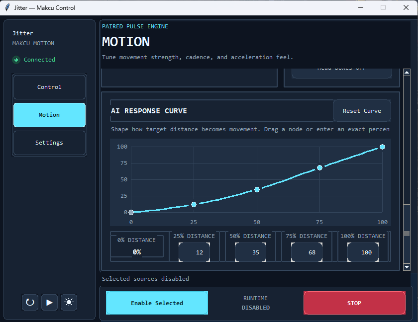

# Jitter — AI Detection และตัวควบคุม Makcu สำหรับ Windows

Jitter เป็นโปรแกรมเดสก์ท็อปสำหรับ Windows ที่พัฒนาด้วย Python และ Tkinter
ใช้ควบคุมอุปกรณ์ Makcu USB โดยรวมความสามารถสองส่วนที่เปิดใช้งานแยกกันได้:

- `Jitter` สร้างการขยับเมาส์สองมิติแบบ paired pulse ที่ปรับแต่งได้
- `AI Aim` ตรวจจับผู้เล่นและศีรษะจากภาพกลางหน้าจอ แล้วขยับเมาส์ไปยัง
  detection ที่ใกล้ crosshair ที่สุดในเฟรมปัจจุบัน

ทั้งสองแหล่งการเคลื่อนไหวสามารถใช้เดี่ยว ๆ หรือเปิดพร้อมกันได้ เมื่อเปิดพร้อมกัน
โปรแกรมจะรวม delta ของ Jitter และ AI Aim ก่อนส่งไปยัง Makcu หาก AI Aim
หาเป้าหมายไม่พบ Jitter จะยังทำงานต่อไปตามปกติ

> โปรแกรมนี้รองรับ Windows เท่านั้น และต้องใช้อุปกรณ์ Makcu สำหรับส่งการขยับเมาส์จริง

## ภาพตัวอย่างแอป



*ตัวอย่างหน้า Motion และ AI Response Curve*

## สารบัญ

- [คุณสมบัติหลัก](#คุณสมบัติหลัก)
- [หลักการเลือกเป้าหมาย AI](#หลักการเลือกเป้าหมาย-ai)
- [ความต้องการของระบบ](#ความต้องการของระบบ)
- [การติดตั้ง](#การติดตั้ง)
- [การเปิดโปรแกรม](#การเปิดโปรแกรม)
- [ขั้นตอนใช้งานแบบย่อ](#ขั้นตอนใช้งานแบบย่อ)
- [การตั้งค่า Jitter](#การตั้งค่า-jitter)
- [การตั้งค่า AI Aim](#การตั้งค่า-ai-aim)
- [Response Curve](#response-curve)
- [Adaptive Zoom](#adaptive-zoom)
- [การเลือกโมเดล ONNX](#การเลือกโมเดล-onnx)
- [Overlay](#overlay)
- [ปุ่มควบคุมและความปลอดภัย](#ปุ่มควบคุมและความปลอดภัย)
- [ไฟล์ตั้งค่าและข้อมูลผู้ใช้](#ไฟล์ตั้งค่าและข้อมูลผู้ใช้)
- [การแก้ปัญหาเบื้องต้น](#การแก้ปัญหาเบื้องต้น)
- [โครงสร้าง repository ที่รองรับ](#โครงสร้าง-repository-ที่รองรับ)
- [การตรวจสอบสำหรับนักพัฒนา](#การตรวจสอบสำหรับนักพัฒนา)
- [การสร้างไฟล์ EXE](#การสร้างไฟล์-exe)
- [สัญญาอนุญาตและไฟล์ประกอบการเผยแพร่](#สัญญาอนุญาตและไฟล์ประกอบการเผยแพร่)

## คุณสมบัติหลัก

- เชื่อมต่อ Makcu อัตโนมัติและพยายามเชื่อมต่อใหม่เมื่ออุปกรณ์หลุด
- เลือกใช้ `Jitter`, `AI Aim` หรือทั้งสองอย่างพร้อมกัน
- ใช้ Trigger และ Modifier ที่กำหนดเป็นเงื่อนไขก่อนขยับจริง
- มีปุ่ม `STOP` สำหรับยกเลิกการเคลื่อนไหวทันที
- มี `Test 3s` สำหรับทดสอบแหล่งการเคลื่อนไหวที่เลือกเป็นเวลา 3 วินาที
- มี global hotkey ค่าเริ่มต้น `-` สำหรับสลับ Master หนึ่งครั้งต่อการกด
- ใช้ ONNX Runtime DirectML เป็น provider หลัก และมี CPU fallback
- จับภาพ RGB ขนาดคงที่ 320×320 พิกเซลจากกึ่งกลางหน้าจอด้วย DXCam
- เลือก detection ใกล้ crosshair ที่สุดจาก head และ player รวมกันทุกเฟรม
- มี response curve 5 จุด, time-based smoothing และ Max Step
- ปรับ capture cadence ตาม refresh rate ของจอหลัก (สูงสุด 240 FPS) และใช้ motion servo เป้าหมายคงที่ 1,000 Hz; อัตราที่ส่งถึง USB/HID จริงขึ้นกับ Makcu, USB และ scheduling ของ Windows
- มี Adaptive Zoom แบบ 1.0×, 1.5× และ 2.0× โดยไม่ขยายภาพบนหน้าจอ
- มี Overlay กล่อง detection พร้อม AI Runtime HUD แบบ click-through และไม่ถูกจับกลับเข้า inference
- เลือกโมเดล `.onnx` ภายนอกได้เฉพาะ runtime โดยไม่บันทึก path ลง config

## หลักการเลือกเป้าหมาย AI

AI Aim ใช้ภาพขนาด 320×320 พิกเซล และถือว่าจุด crosshair อยู่ที่
`(160, 160)` ทุกเฟรมมีขั้นตอนดังนี้:

1. รับ detection จากโมเดล ONNX
2. เก็บเฉพาะ class ที่รองรับและมี confidence ถึงค่าที่กำหนด
3. สร้าง aim point ของ head และ player ทุกตัว
4. รวม head และ player ไว้ในรายการเดียวกัน
5. คำนวณระยะเส้นตรงจาก aim point ไปยัง `(160, 160)`
6. เลือก aim point ที่มีระยะน้อยที่สุดและเผยแพร่ทันทีในเฟรมนั้น

ระบบไม่ให้สิทธิ์ head มากกว่า player และไม่ยึดตัวที่เลือกจากเฟรมก่อนหน้า
จึงสามารถสลับไปยัง detection ใหม่ที่ใกล้ crosshair กว่าได้ทันที หากสองจุดมี
ระยะเท่ากันพอดี จะใช้ลำดับ output จาก detector เป็นตัวตัดสิน

โมเดลที่รองรับใช้ class ดังนี้:

| Class ID | ความหมาย | Aim point เมื่อ Target Area เป็น Head |
|---:|---|---|
| `0` | Player | กึ่งกลางแนวนอนและ 20% จากขอบบนของกล่อง |
| `7` | Head | จุดกึ่งกลางของกล่องศีรษะ |

Target Area มีสามระดับและเป็นสถานะ runtime เท่านั้น:

| Target Area | Detection ที่ใช้ได้ | ตำแหน่งบนกล่อง player |
|---|---|---:|
| `Head` | Head และ Player | 20% จากด้านบน |
| `Upper Body` | Player | 30% จากด้านบน |
| `Chest` | Player | 42% จากด้านบน |

## ความต้องการของระบบ

- Windows 10 หรือใหม่กว่า
- Python 3.11 ขึ้นไป พร้อม Tkinter
- อุปกรณ์ Makcu ที่รองรับและไดรเวอร์ USB
- จอภาพที่มีความละเอียดเพียงพอสำหรับพื้นที่จับภาพกึ่งกลาง 320×320
- GPU/ระบบที่รองรับ DirectML สำหรับ inference ที่แนะนำ
- หาก DirectML ใช้งานไม่ได้ โปรแกรมสามารถ fallback ไป CPU ได้

Dependencies ถูก pin ไว้ใน `requirements.txt`:

- `makcu==2.3.1`
- `pyserial==3.5`
- `pygame-ce==2.5.6`
- `onnxruntime-directml==1.24.4`
- `dxcam==0.3.0`
- `comtypes==1.4.16`
- `numpy==2.5.2`

โปรเจกต์ไม่ใช้ Torch, Ultralytics หรือ OpenCV

## การติดตั้ง

เปิด PowerShell ในโฟลเดอร์โปรเจกต์ แล้วติดตั้ง dependencies:

```powershell
python -m pip install -r requirements.txt
```

ตรวจว่า Python และ package หลักนำเข้าได้:

```powershell
python -c "import makcu, serial, pygame, onnxruntime, dxcam, comtypes, numpy"
```

## การเปิดโปรแกรม

รันจาก source:

```powershell
python main.py
```

หรือดับเบิลคลิก `run_gui.bat`

เมื่อเปิดโปรแกรมครั้งแรก:

- `Jitter` และ `AI Aim` จะยังไม่ถูกเลือก
- `Master` จะอยู่ในสถานะปิด
- `Overlay` จะอยู่ในสถานะปิด
- โมเดลเริ่มต้นคือ `models/all_games_320.onnx`
- global hotkey เริ่มต้นคือ `-`

## ขั้นตอนใช้งานแบบย่อ

1. ต่อ Makcu และรอให้สถานะเป็น Connected
2. เลือก Trigger และ Modifier หากต้องการ
3. เลือก `Jitter`, `AI Aim` หรือเลือกทั้งสองปุ่ม
4. ปรับค่าบนหน้า Motion
5. เปิด `Master` หรือกด global hotkey
6. กด Trigger พร้อม Modifier ที่ตั้งไว้เพื่อเริ่มขยับ
7. ปล่อย Trigger/Modifier หรือกด `STOP` เพื่อหยุดทันที

การเลือกแหล่งการเคลื่อนไหวไม่ได้ทำให้เมาส์ขยับเอง ต้องมีทั้ง Master และเงื่อนไข
Trigger/Modifier ครบก่อนเสมอ ยกเว้น `Test 3s` ซึ่งข้าม Trigger ชั่วคราว

## การตั้งค่า Jitter

Jitter ส่ง paired pulse บนแกนเอียง 45 องศาไปทางขวาจากแนวตั้ง ลำดับหนึ่งคู่คือ
`up-right then down-left` และอีกคู่จะสลับทิศทาง จากนั้นวนซ้ำ ผลรวมเชิงตั้งใจของ
pulse ที่ครบคู่เป็นศูนย์ แต่ผลจริงขึ้นอยู่กับวิธีประมวลผล input ของโปรแกรมปลายทาง

| ตัวควบคุม | ช่วง/ตัวเลือก | ความหมาย |
|---|---|---|
| `Pulse Size` | 1–8 px | ขนาดต่อครึ่ง pulse |
| `Pulse Rate` | 20–120 Hz | จำนวนคู่ pulse ต่อวินาที |
| `Ramp Mode` | `Instant`, `Smooth` | เริ่มเต็มแรงทันที หรือไต่ระดับใน 150 ms |

Presets:

- `Soft`: 1 px, 30 Hz, Smooth
- `Balanced`: 2 px, 60 Hz, Smooth
- `Strong`: 4 px, 100 Hz, Instant
- `Custom`: ค่าปัจจุบันไม่ตรง preset ใดพอดี

## การตั้งค่า AI Aim

| ตัวควบคุม | ช่วง | ค่าเริ่มต้น | ความหมาย |
|---|---:|---:|---|
| `Confidence` | 0.05–0.95 | 0.35 | confidence ขั้นต่ำของ detection |
| `Aim Strength` | 0.05–2.00 | 0.35 | ตัวคูณความเร็วจาก response curve |
| `Smoothing` | 0.00–0.95 | 0.65 | ความนุ่มของการเปลี่ยนความเร็วตามเวลา |
| `Max Step` | 1–127 | 20 | delta สูงสุดที่รายงานต่อรอบ servo |
| `Target Area` | Head/Upper Body/Chest | Head | ระดับแนวตั้งของ aim point |

AI Aim ใช้ time-based servo microsteps เพื่อให้การขยับระหว่างเฟรม inference
ต่อเนื่องขึ้น เป้าหมายที่ยังใช้ไม่หมดจะหมดอายุเมื่อผ่าน 150 ms เพื่อไม่ให้ส่ง
ตำแหน่งเก่าค้างอยู่ การ clamp, acceleration limit และ fractional accumulation
ยังคงทำงาน และ movement ส่วนเกินจะถูกทิ้งแทนการสะสมคิว

## Response Curve

Response Curve แปลงระยะจาก crosshair เป็นความเร็วการขยับ มีจุดควบคุมห้าจุดที่
ระยะ `0%`, `25%`, `50%`, `75%` และ `100%` ของรัศมีอ้างอิง:

```text
ระยะ:       0%   25%   50%   75%   100%
ค่าเริ่มต้น: 0%   12%   35%   68%   100%
```

- จุดแรกถูกตรึงที่ศูนย์
- อีกสี่จุดลากบนกราฟหรือกรอกเปอร์เซ็นต์แบบ exact value ได้
- ค่าต้องเรียงจากน้อยไปมากและอยู่ในช่วง 0–100%
- `Reset Curve` คืนค่าทั้งกราฟเป็นค่าเริ่มต้น
- Curve กำหนดรูปทรงการตอบสนอง ส่วน Aim Strength ใช้ปรับสเกลรวม
- Smoothing กำหนดความเร็วในการไล่ตามค่า curve และ Max Step จำกัดผลสุดท้าย

Response Curve เป็นการตั้งค่า AI ใหม่เพียงส่วนเดียวที่บันทึกลง config

## Adaptive Zoom

Adaptive Zoom ทำงานอัตโนมัติและไม่มีตัวเลือกที่บันทึกถาวร ทุกเฟรมจะเริ่มด้วย
base pass แบบเต็มพื้นที่ 1.0× ก่อนเสมอ เป้าหมายขนาดเล็กที่ถูกเลือกจาก base pass
แล้วเท่านั้นจึงมีสิทธิ์รับ refinement pass เพิ่มในเฟรมเดียวกัน

- `1.0×`: base inference เต็มเฟรม
- `1.5×`: refinement ที่กว้างกว่า ใช้กับเป้าหมายใหม่หรือเป้าหมายที่ยังไม่นิ่ง
- `2.0×`: refinement ที่ละเอียดขึ้นหลังยืนยันความนิ่งและผ่าน cooldown 100 ms

refinement ทำงานเฉพาะขณะเชื่อมต่อ Makcu, เปิด Master, เลือก AI Aim และกด
Trigger/Modifier ครบในการเคลื่อนไหวปกติ จะไม่ทำงานเมื่อ idle, ใช้ Overlay
อย่างเดียว หรือระหว่าง `Test 3s`

หาก refinement ไม่สำเร็จ โปรแกรมจะใช้ผล 1.0× ของเฟรมเดียวกันต่อไป ไม่ถือ
target เก่ามาใช้ และไม่เพิ่ม inference call เกินที่กำหนด กล่อง refinement
จะสัมพันธ์กับ base target ที่ถูกเลือกไว้เพื่อไม่ให้ซูมไปหยิบวัตถุข้างเคียง

Adaptive Zoom ไม่ได้ขยายภาพที่ผู้ใช้เห็น และไม่สามารถค้นหาเป้าหมายที่ base pass
ตรวจไม่พบ ค่า `ZOOM` และสถานะความนิ่งทั้งหมดเป็น runtime state

## การเลือกโมเดล ONNX

ทุกครั้งที่เปิดโปรแกรมจะเริ่มจากโมเดลที่ bundle มากับโปรเจกต์:

```text
models/all_games_320.onnx
```


พื้นที่ capture ยังคง 320×320 สำหรับทุกโมเดล และ FOV, targeting กับ movement
ยังใช้พิกัด canonical 320×320 เดิม
`jitter_app/ai/resize.py` เป็น shared primitive สำหรับ resize ภาพ RGB เท่านั้น ส่วน detector จะ scale
ผลลัพธ์กลับมาเป็นพิกัด 320×320 ก่อนเผยแพร่ โมเดล 640 จึงเป็นการ upscale
พื้นที่จริง 320×320 เดิม ไม่ใช่การขยายพื้นที่ที่จับภาพ โมเดล 160 อาจใช้ inference น้อยลง,
320 เป็นจุดสมดุลเริ่มต้น และ 640 อาจใช้เวลามากขึ้น ทั้งหมดนี้ไม่รับประกัน FPS หรือความแม่นยำ

โมเดลเริ่มต้นเมื่อเปิดโปรแกรมยังคงเป็น bundled `models/all_games_320.onnx` เสมอ path และขนาดของ
โมเดลภายนอกเป็น runtime-only: ไม่ถูกบันทึกลง config, copy, หรือ package ไปกับ release

แถว `MODEL` จะแสดง `Default · all_games_320.onnx · 320×320` ปุ่ม `Browse...` ใช้เลือก
ไฟล์ `.onnx` ภายนอกสำหรับ process ปัจจุบัน และ `Use Default` ใช้กลับไปโมเดลหลัก


รองรับ output ภายนอก 2 แบบ โดยระบบตรวจจาก contract ของโมเดลอัตโนมัติ:

1. แบบ post-NMS เดิม: `output0` ชนิด float รูปร่าง `[1,300,6]` (`x1,y1,x2,y2,confidence,class_id`) โดย class 0 คือ player และ class 7 คือ head
2. แบบ raw Ultralytics หนึ่งคลาส: `output0` ชนิด float รูปร่าง `[1,5,K]` (`center_x,center_y,width,height,confidence`) โดยขนาดต้องจับคู่กับจำนวน candidate ดังนี้: `160 → K=525`, `320 → K=2100`, `640 → K=8400`

แบบ raw ต้องมี metadata `task=detect` และ `names` ที่ระบุ class 0 เพียงคลาสเดียว ชื่อคลาส เช่น `Enemy` ใช้เพื่ออธิบายเท่านั้น ระบบจะ map เป็น player class 0 และจะไม่สร้าง head class 7 เพิ่มเอง
ใน metadata map: custom metadata-map keys/values are strings และ additional all-string fields are allowed
ค่า `names` string-valued field ต้องถูก parse อย่างปลอดภัยด้วย `ast.literal_eval` และต้องได้ผล exactly `{0: "<non-empty label>"}` เท่านั้น (key เป็น integer 0 และ label เป็น string ที่ไม่ว่าง)
การคำนวณ NMS ใช้ NumPy ภายในโปรแกรม ด้วย confidence ขั้นต่ำ `0.05`, IoU `0.45` และส่งออกไม่เกิน `300` กล่องต่อเฟรม

ระบบ reject `[1,K,5]`, raw แบบหลายคลาส, tensor แบบ dynamic/rectangular, จำนวน candidate ที่ไม่ใช่จำนวนที่ระบุ และ metadata ที่ขาดหรือ malformed
`jitter_app/ai/yolo.py` เป็น pure NumPy decoder สำหรับ raw และ downstream ยังใช้ Detection แบบเดิมและพิกัด canonical 320×320
โมเดลภายนอกเป็น runtime-only และจะไม่ถูกบันทึก, copy, download หรือ package; มีเฉพาะ `models/all_games_320.onnx` ที่ถูก bundle

โปรแกรมตรวจ contract นอก Tk UI thread และพัก AI ระหว่างสลับโมเดล เมื่อโมเดลใหม่
พร้อมจึงเริ่ม runtime/motion ที่มีสิทธิ์ใหม่ หาก startup ของโมเดล candidate ล้มเหลว
จะ rollback ไปโมเดลก่อนหน้าหนึ่งครั้ง

ข้อจำกัดด้านข้อมูลโมเดล:

- ไม่ดาวน์โหลดหรือฝึกโมเดล
- ไม่คัดลอกโมเดลภายนอกเข้าโปรเจกต์
- ไม่บันทึก path ของโมเดลภายนอกลง `config.json`
- ไม่ bundle โมเดลภายนอกเข้า release
- ปิดการเปลี่ยนโมเดลระหว่าง `Test 3s`

SHA-256 ของโมเดลหลักที่อนุมัติคือ:

```text
6B9157D6419F9DBC40D2DCECCC33A3387078C86F1C5872EDA544B174FF48499C
```

Self-check ยังคงตรวจเฉพาะ bundled 320 model ตาม SHA-256 ข้างต้น และตรวจว่า
ONNX Runtime ใช้ `DmlExecutionProvider` ได้จริง ไม่มีการเปลี่ยนไปตรวจโมเดลภายนอก
หรือเพิ่มโมเดลอื่นเข้า package

สำหรับทุก contract input `images` ต้องเป็น float รูปร่าง `[1,3,N,N]` โดย `N` เป็น `160`, `320` หรือ `640` เท่านั้น จึงรองรับ input ที่ตรวจสอบแล้ว `[1,3,160,160]`, `[1,3,320,320]` และ `[1,3,640,640]`; โมเดลขนาด `128/256` หรือขนาดอื่นนอกเหนือจากนี้ถูก reject
path ของโมเดลภายนอกและไฟล์โมเดลจะไม่ถูกบันทึก, copy, download หรือ package และใช้ได้เฉพาะ process ปัจจุบัน

## Overlay

Overlay เป็นหน้าต่างโปร่งใสเต็มขนาดจอหลัก โดยกล่อง detection ถูกวางทับพื้นที่
capture 320×320 ที่กึ่งกลางจอ:

- เริ่มต้นปิดและทำงานแยกจากการเลือก AI Aim
- click-through จึงไม่ขวางการคลิก
- ถูก exclude จาก capture เพื่อไม่ให้เห็นกล่องของตัวเองใน inference
- HUD แสดง FPS, provider, zoom และสถานะ lock เป็น `HEAD`, `PLAYER` หรือ `NONE`
- หากเฟรม detection เก่ากว่า 150 ms สถานะ lock จะกลับเป็น `NONE`
- ส่วน `OVERLAY CUSTOM` ในหน้า Motion ใช้ปรับ Overlay แบบสดขณะรัน
- เลือก `Box Color`, เปิด/ปิดกล่อง Head และ Player แยกกัน และปรับความหนากรอบ `1–8`
- Label เลือกได้ระหว่างปิด, ชื่อคลาส หรือชื่อคลาสพร้อม confidence
- HUD เปิด/ปิดได้ เลือกมุมทั้ง 4 มุม ตั้งระยะ X/Y จากขอบจอ และปรับขนาดตัวอักษร `8–24`
- เลือกสี HUD แยกจากสีกรอบ และเปิด/ปิด FPS, Provider, Zoom และ Lock แยกกันได้
- `Reset Overlay` คืนค่าเริ่มต้นทั้งหมด โดยตำแหน่ง HUD จะถูกจำกัดไม่ให้อยู่นอกจอ
- ตัวเลือกใหม่เป็น runtime-only และเริ่มจากค่า default ทุกครั้งที่เปิดโปรแกรม ส่วน `Box Color` กับ `Head Boxes` ยังบันทึกตาม schema 5
- การซ่อนกล่อง head ไม่ได้ตัด head ออกจาก target selection
- Overlay-only สามารถเรียก inference ได้โดยไม่เปิด AI Aim สำหรับ movement

เมื่อเกิด AI runtime error โปรแกรมจะซ่อน Overlay และยกเลิกการเลือก AI Aim
หากยังเลือก Jitter และ Master เปิดอยู่ Jitter จะทำงานต่อผ่าน gate เดิม แต่ถ้ามี
AI Aim อย่างเดียว โปรแกรมจะปิด Master

## ปุ่มควบคุมและความปลอดภัย

- `Master`: arm แหล่งการเคลื่อนไหวที่เลือก
- Global hotkey `-`: สลับ Master หนึ่งครั้งต่อการกด
- `Test 3s`: ใช้ engine จริงของแหล่งที่เลือกตอนเริ่ม test และข้าม Trigger ชั่วคราว
- `STOP`: ยกเลิก movement, test, Overlay และ inference demand ทันที

เหตุการณ์ต่อไปนี้จะส่งสัญญาณหยุดโดยไม่รอ movement interval ปกติ:

- กด `STOP`
- ปิด Master หรือใช้ hotkey ปิด
- ปล่อย Trigger/Modifier
- เปลี่ยนแหล่ง Jitter/AI Aim
- Makcu disconnect
- ปิดโปรแกรม

การปิดหน้าต่างคือการออกจากโปรแกรม ไม่มี system tray

## ไฟล์ตั้งค่าและข้อมูลผู้ใช้

ไฟล์ runtime อยู่ข้าง source script หรือข้าง executable ที่ package แล้ว:

- `config.json`: การตั้งค่าปัจจุบัน
- `config.json.bak`: backup ก่อนหน้า
- `app.log`: diagnostic log แบบ thread-safe

ไฟล์เหล่านี้ถูก ignore โดย Git การเขียน config ใช้ temporary file, flush,
`fsync`, backup และ atomic replace เพื่อลดความเสี่ยงไฟล์เสีย

Schema 5 บันทึกค่าที่ผ่าน validation รวมถึง:

- การตั้งค่า Jitter และ AI Aim ที่อนุญาต
- Response Curve
- สี Overlay และการแสดงกล่อง head
- global hotkey และการตั้งค่าเสียง

สิ่งที่ไม่ถูกบันทึก ได้แก่ source selection, Master, Overlay visibility,
Target Area, model path ภายนอก, target/snapshot, FPS, provider, display cadence,
servo cadence และ zoom status

หากพบ schema 6 หรือใหม่กว่าซึ่งโปรแกรมรุ่นนี้ไม่รองรับ โปรแกรมจะใช้ค่า default
ในหน่วยความจำ ปิดการ save และไม่แก้ไฟล์ต้นฉบับ

## การแก้ปัญหาเบื้องต้น

### Makcu ไม่เชื่อมต่อ

1. ถอดและเสียบอุปกรณ์ใหม่
2. ตรวจไดรเวอร์และพอร์ต USB
3. ปิดโปรแกรมอื่นที่อาจจับ serial port อยู่
4. เปิด `app.log` เพื่อดูรายละเอียดการ reconnect

### AI แสดง Ready แต่เมาส์ไม่ขยับ

ตรวจให้ครบว่า:

- เลือก `AI Aim` แล้ว
- เปิด `Master` แล้ว
- Makcu อยู่ในสถานะ Connected
- กด Trigger และ Modifier ตามที่ตั้งไว้
- Confidence ไม่สูงจน detection ถูกตัดทิ้งทั้งหมด
- Target Area ตรงกับ class ที่โมเดลตรวจได้

### AI สลับไปอีกตัวเมื่อเป้าหมายอยู่ใกล้กัน

นี่เป็นพฤติกรรมที่ออกแบบไว้ ระบบเลือก detection ที่ใกล้ crosshair ที่สุดใหม่
ทุกเฟรมและไม่จำ identity จากเฟรมก่อน หากต้องการให้ตัวใดถูกเลือก ให้วาง crosshair
ให้ aim point ของตัวนั้นใกล้ศูนย์กลางกว่า

### เลือกโมเดลแล้วถูก Reject

โมเดลต้องเป็น `.onnx` และตรง input/output contract ทุกค่า ตรวจชื่อ tensor,
shape, dtype และ class ID ตามตารางในหัวข้อการเลือกโมเดล โปรแกรมไม่รองรับโมเดล
ที่ถูกเข้ารหัสหรือใช้ runtime/contract คนละแบบ

### DirectML ใช้งานไม่ได้

รัน self-check:

```powershell
python .\main.py --ai-runtime-self-check
```

ผลปกติจะเป็น JSON ที่มี `"status": "ok"` และ
`"provider": "DmlExecutionProvider"` ตรวจ driver GPU และ package
`onnxruntime-directml` หาก provider ไม่ตรง

### Overlay ทับภาพหรือรับคลิก

Overlay ถูกออกแบบให้ click-through และ capture-excluded บน Windows หากพฤติกรรม
ไม่ตรง ให้ดู `app.log`, ตรวจว่าใช้ Windows รุ่นที่รองรับ และ restart โปรแกรม

## โครงสร้าง repository ที่รองรับ

ไฟล์ source ที่ใช้งานจริงอยู่ตามโครงสร้าง package นี้:

- `main.py`
- `distribution_metadata.py`
- `jitter_app/__init__.py`
- `jitter_app/resources.py`
- `jitter_app/ai/__init__.py`
- `jitter_app/ai/capture.py`
- `jitter_app/ai/detection.py`
- `jitter_app/ai/model_selection.py`
- `jitter_app/ai/service.py`
- `jitter_app/ai/targeting.py`
- `jitter_app/ai/tracking.py`
- `jitter_app/ai/resize.py`
- `jitter_app/ai/yolo.py`
- `jitter_app/ai/zoom.py`
- `jitter_app/motion/__init__.py`
- `jitter_app/motion/engine.py`
- `jitter_app/motion/combined.py`
- `jitter_app/device/__init__.py`
- `jitter_app/device/makcu.py`
- `jitter_app/device/hotkeys.py`
- `jitter_app/device/display_timing.py`
- `jitter_app/presentation/__init__.py`
- `jitter_app/presentation/ui.py`
- `jitter_app/presentation/widgets.py`
- `jitter_app/presentation/overlay.py`
- `jitter_app/presentation/sound.py`
- `jitter_app/config/__init__.py`
- `jitter_app/config/store.py`

โมเดลที่ bundle มีเพียง `models/all_games_320.onnx` เท่านั้น; โมเดลภายนอกเป็น
runtime-only และไม่ถูก copy, package หรือบันทึก path ลง config

## การตรวจสอบสำหรับนักพัฒนา

รันจาก root ของ repository:

```powershell
$jitterSources = @('main.py', 'distribution_metadata.py') + @(Get-ChildItem -LiteralPath 'jitter_app' -Recurse -Filter '*.py' | Sort-Object FullName | ForEach-Object { $_.FullName })
python -m py_compile @jitterSources
python -m unittest discover -s tests -v
python -c "import makcu, serial, pygame, onnxruntime, dxcam, comtypes, numpy"
python .\main.py --ai-runtime-self-check
python .\distribution_metadata.py --review-json
```

การเปลี่ยนแปลงที่เกี่ยวกับ hardware ต้องตรวจด้วย Makcu จริงเพิ่มเติม:

- Trigger และ Modifier ทุกชุดที่รองรับ
- Jitter อย่างเดียว, AI Aim อย่างเดียว และโหมดรวม
- reconnect หลังอุปกรณ์หลุด
- `Test 3s`, global hotkey, `STOP` และ shutdown
- Overlay ต้อง click-through และไม่ปรากฏใน capture
- ทิศทาง paired Jitter และ preset Soft/Balanced/Strong

## การสร้างไฟล์ EXE

การ package เป็นงานที่ต้องสั่งโดยเจาะจง การพัฒนาทั่วไปไม่สร้าง EXE อัตโนมัติ

วิธี interactive:

```powershell
.\gen.bat
```

จากนั้นพิมพ์คำยืนยัน `BUILD` ให้ตรงทุกตัวอักษร `gen.bat` ไม่รับ argument และ
จะไม่ส่งต่อ argument ของ batch

คำสั่ง Python สำหรับ help, review หรือ automation:

```powershell
python .\distribution_metadata.py --help
python .\distribution_metadata.py --review-json
python .\distribution_metadata.py --build
```

build ใช้ Nuitka และโหลด `nuitka-package.config.yml` เพื่อ bundle
`onnxruntime/capi/DirectML.dll` จาก ONNX Runtime DirectML หลังสร้างเสร็จต้องผ่าน:

```powershell
.\build-output\Jitter.exe --ai-runtime-self-check
```

ไฟล์ผลลัพธ์อยู่ที่ `build-output\Jitter.exe` และ log อยู่ที่
`build-output\build.log` ห้ามแก้ไฟล์ใน build output เป็น source

## สัญญาอนุญาตและไฟล์ประกอบการเผยแพร่

Jitter และโมเดลที่ bundle มากับโปรเจกต์เผยแพร่ภายใต้ GNU Affero General Public
License version 3 การแจก binary ต้องเปิดให้เข้าถึง corresponding source ของ
Jitter เวอร์ชันเดียวกัน รวมถึง build scripts และ distribution metadata

Dependencies แต่ละตัวมีข้อกำหนดแยกกัน ทุก release ต้องวางรายการต่อไปนี้ข้าง EXE:

- `LICENSE`
- [THIRD_PARTY_NOTICES.md](THIRD_PARTY_NOTICES.md)
- ไดเรกทอรี `licenses/` ทั้งชุด
- [คู่มือและ checklist การเผยแพร่](licenses/README.md)

Jitter source เพียงอย่างเดียวไม่ครอบคลุมภาระ notice, corresponding-source หรือ
relinking ของ dependency ทุกตัว โปรดตรวจ `licenses/manifest.json` และเอกสารใน
`licenses/` ก่อนเผยแพร่เสมอ
